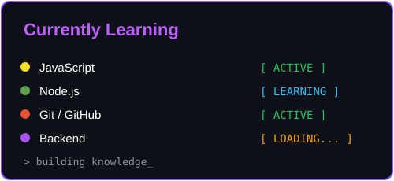

<div align="center">
  <h1>< Ray Dev /> FULLSTACK DEVELOPER</h1>
  
### Minha Jornada: Da Curiosidade à Criação Digital
</div>

<p>
Desde a infância, minha paixão por desvendar o "funcionar" da tecnologia me impulsionou. Comecei com aplicativos minimalistas, edições e aulas básicas de informática, sempre buscando aprender e criar. Mas minha jornada profissional me levou por 3 anos a trabalhar em uma multinacional com atendimento ao cliente e vendas, onde desenvolvi <strong>proatividade, aprendizado rápido, trabalho em equipe e resiliência</strong> na resolução de problemas. A pandemia de 2021 marcou um ponto de virada, me levando a buscar um propósito mais alinhado com meus valores e minha saúde.

Nesse período, mergulhei no universo digital, aprendendo a vender serviços de design, edição de vídeo e softwares para startups. Essa experiência me mostrou a importância de entender a mente humana, o que me levou a estudar <strong>hipnose clínica, persuasão, linguagem Ericksoniana e a psicologia da decisão de compra</strong>. Essa base me equipou com uma perspectiva única sobre a comunicação, a experiência do usuário e a resolução criativa de problemas, que hoje aplico no desenvolvimento de software.

Em 2026, com o DevClub, encontrei o ambiente e a didática que me fizeram mergulhar de cabeça na programação, unindo minha paixão por criar com meu desejo de construir soluções reais e impactantes para a sociedade.
</p>


## 👨‍💻 About me

```javascript
const developer = {
  name: "Ray",
  role: "Fullstack Developer",
  focus: "Web Development, Automation & Artificial Intelligence",
  mindset: "Code. Learn. Build. Repeat.",
  status: "Every new code, a new possibility and a better version of myself" 
};

```


## Hard Skills:
<h3>Frontend:</h3>
<ul>
<li>HTML ✔️</li>
<li>CSS ✔️</li>
<li>(UI/UX) Conceitos de Design ✔️</li> 
<li>JavaScript (Estudando)</li>
</ul>

<h3>Ferramentas:</h3>
<ul>
<li>Git(Estudando)</li>
<li>GitHub ✔️</li>
<li>VS Code ✔️</li>
<li>Figma(Estudando)</li>
</ul>


<h3>Backend:</h3>
<ul>
<li>Automação (Meta)</li>
<li>Banco de dados (Meta)</li>
<li>Node.js (Meta)</li>
</ul>


<h3>Soft Skills:</h3>
<ul>
<li>Resolução Criativa de Problemas: Abordagem inovadora para desafios técnicos e de negócio.</li>
<li>Comunicação & Persuasão: Experiência em vendas e psicologia para entender e apresentar soluções eficazes.</li>
<li>Proatividade & Autodidatismo: Busca contínua por conhecimento e novas tecnologias.</li>
<li>Trabalho em Equipe: Colaboração eficaz e contribuição construtiva.</li>
<li>Aprendizagem Rápida: Adaptação ágil a novas ferramentas e conceitos.</li>
</ul>


<h3> 🔭 Próximos Objetivos & Visão de Futuro</h3>

Estou em constante evolução e tenho metas claras para minha jornada como desenvolvedora:
<ul>
<li>Curto Prazo: Iniciar minha carreira como freelancer, aplicando minhas habilidades em projetos práticos e construindo um portfólio robusto.</li>

<li>Médio Prazo: Conquistar uma vaga como Desenvolvedora Fullstack em uma empresa reconhecida, contribuindo para projetos desafiadores e de grande impacto.</li>

<li>Longo Prazo: Aprofundar meus conhecimentos em Automação e Inteligência Artificial, desenvolvendo soluções inovadoras que otimizem processos e criem novas possibilidades.</li>
</ul>


<h3> 💡 O Ambiente Onde Prospero</h3>

Busco um ambiente de trabalho flexível, onde haja clareza nas regras e demandas, mas que me conceda a autonomia e o espaço para resolver problemas e criar da forma mais criativa e eficaz, agregando valor tanto para o projeto quanto para meu desenvolvimento pessoal.


<br>
<br>

<p align="center">
  
  
</p>
